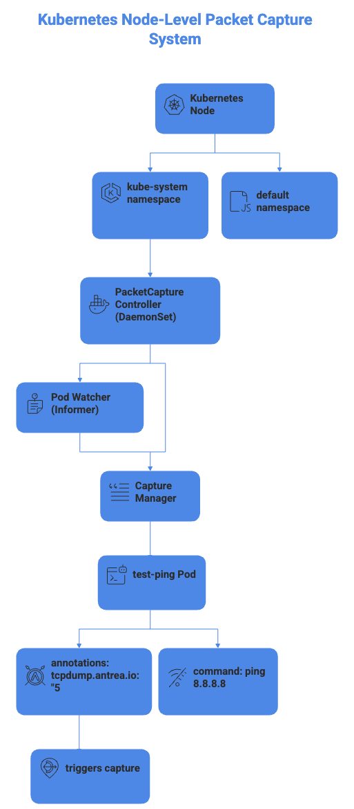
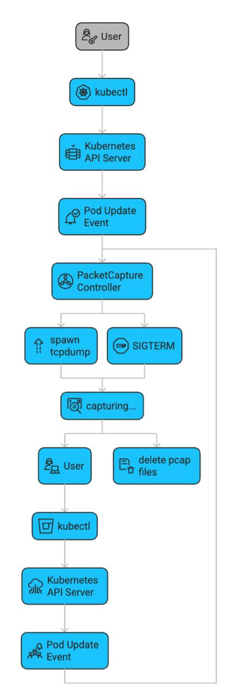
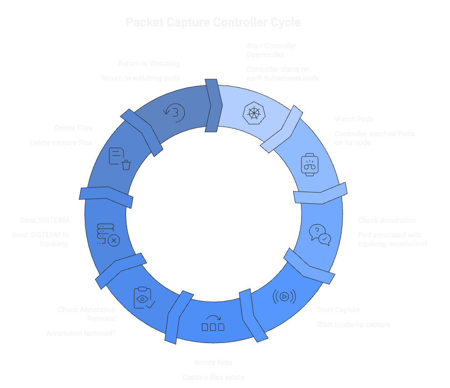
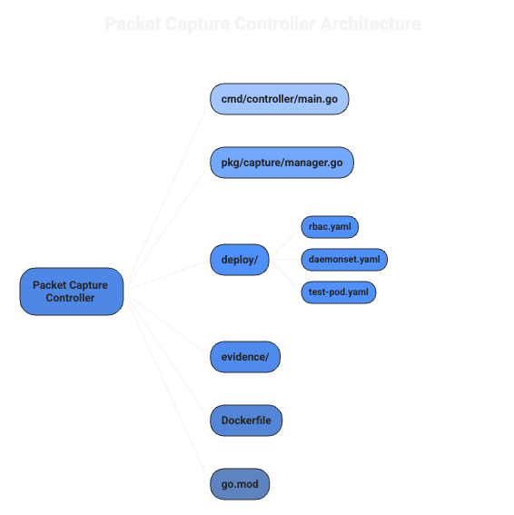
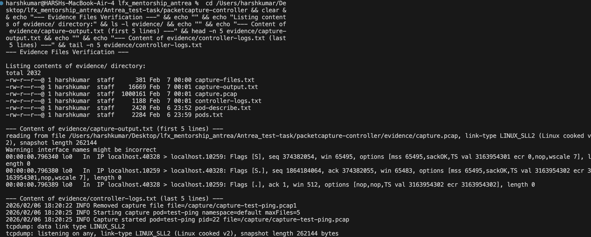
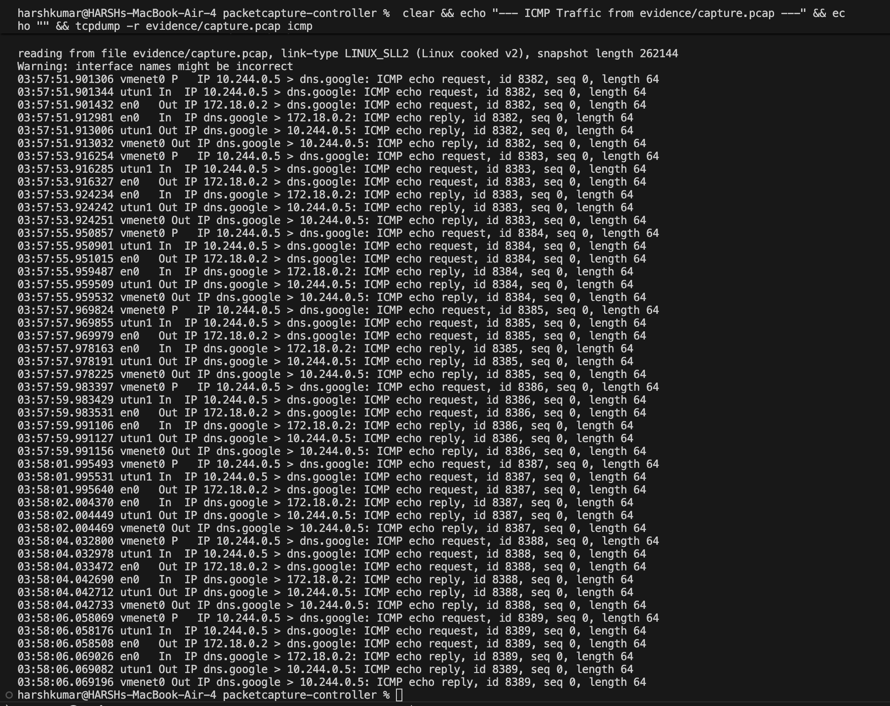
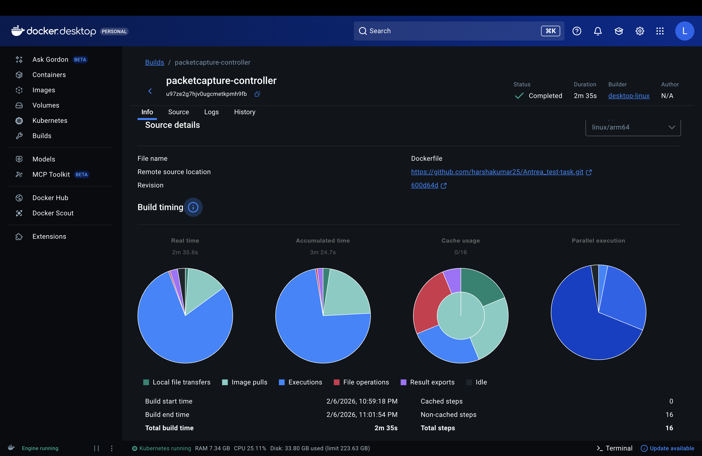
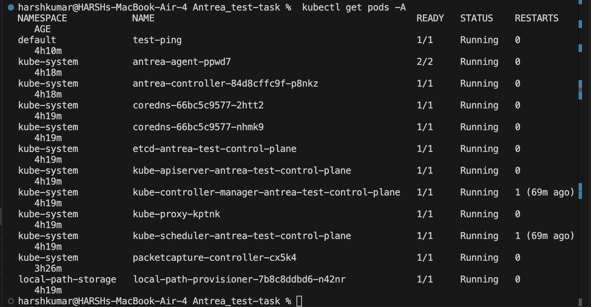

# PacketCapture Controller - LFX Mentorship 2026_01 Test Task #7743

A minimal Kubernetes controller that performs on-demand packet captures via tcpdump when Pods are annotated with `tcpdump.antrea.io: "N"`.

## Overview

This project implements a "poor-man's version" of Antrea's PacketCapture feature as a learning exercise for understanding BPF filter generation. The controller runs as a DaemonSet and watches for Pod annotations to trigger packet captures.

### Architecture



### Workflow Diagram



### How It Works

1. **Controller DaemonSet** runs on each node in `kube-system` namespace
2. Each controller instance watches only Pods scheduled on its own node (via field selector)
3. When a Pod is annotated with `tcpdump.antrea.io: "N"`:
   - Controller spawns `tcpdump -C 1 -W <N> -w /capture/capture-<Pod name>.pcap -i any`
   - N is the maximum number of 1MB capture files to rotate
4. When annotation is removed:
   - Controller sends SIGTERM to tcpdump process
   - Capture files are deleted



## Project Structure




## Quick Start

### Prerequisites
- Docker (https://docs.docker.com/get-docker/)
- kind (Kubernetes in Docker) (https://kind.sigs.k8s.io/docs/user/quick-start/)
- kubectl (https://kubernetes.io/docs/tasks/tools/)
- Helm (for Antrea installation) (https://helm.sh/docs/intro/install/)
- Go 1.23+ (https://go.dev/doc/install)

### Setup

1. **Create kind cluster with CNI disabled:**

```bash
kind create cluster --name antrea-test --config kind-config.yaml
```

2. **Install Antrea CNI:**

```bash
helm repo add antrea https://charts.antrea.io
helm repo update
helm install antrea antrea/antrea -n kube-system
```

3. **Wait for Antrea to be ready:**

```bash
kubectl wait --for=condition=Ready pods -l app=antrea -n kube-system --timeout=120s
```

4. **Build and load the controller image:**

```bash
docker build -t packetcapture-controller:latest .
kind load docker-image packetcapture-controller:latest --name antrea-test
```

5. **Deploy the controller:**

```bash
kubectl apply -f deploy/rbac.yaml
kubectl apply -f deploy/daemonset.yaml
```

### Verification

1. **Deploy test Pod:**

```bash
kubectl apply -f deploy/test-pod.yaml
kubectl wait --for=condition=Ready pod/test-ping --timeout=60s
kubectl get pods -o wide  # Note the node
```

2. **Start capture by adding annotation:**

```bash
kubectl annotate pod test-ping tcpdump.antrea.io="5"
```

3. **Check controller logs:**

```bash
kubectl logs -n kube-system -l app=packetcapture-controller --tail=20
# Expected: "Starting capture" and "Capture started"
```

4. **Verify capture files in controller pod:**

```bash
# Find the controller pod on the same node as test-ping
kubectl get pods -n kube-system -l app=packetcapture-controller -o wide

# Check capture files
kubectl exec -n kube-system <controller-pod> -- ls -la /capture/
kubectl exec -n kube-system <controller-pod> -- ps aux | grep tcpdump
```

5. **Stop capture by removing annotation:**

```bash
kubectl annotate pod test-ping tcpdump.antrea.io-
```

6. **Verify cleanup:**

```bash
kubectl logs -n kube-system -l app=packetcapture-controller --tail=10
# Expected: "Annotation removed", "Stopping capture", "Removed capture file"
```

## Evidence Collection

```bash
# Describe the annotated pod
kubectl describe pod test-ping > evidence/pod-describe.txt

# Get all pods status
kubectl get pods -A -o wide > evidence/pods.txt

# List capture files (while capture is running)
kubectl exec -n kube-system <controller-pod> -- ls -la /capture/ > evidence/capture-files.txt

# Copy pcap file
kubectl cp kube-system/<controller-pod>:/capture/capture-test-ping.pcap0 evidence/capture.pcap

# Read pcap file
tcpdump -r evidence/capture.pcap > evidence/capture-output.txt
```


## Evidence

All evidence files, including logs and captures, were successfully generated and can be found in the `evidence/` directory. Here is a summary:



### About capture.pcap

The \`capture.pcap\` file is in **binary pcap format** (not human-readable text). To view its contents:

```bash
# View all captured packets
tcpdump -r evidence/capture.pcap | head -20

# View ICMP ping traffic from the test pod
tcpdump -r evidence/capture.pcap icmp
```

Or open it in **Wireshark** for graphical analysis.

### Sample Captured Traffic

The pcap file contains actual network traffic from the `test-ping` Pod. The following screenshot shows the captured ICMP ping requests and replies, proving the controller is working correctly.



## Verification Results

### Docker Build

The container image was successfully built using Docker Desktop:

| Metric | Value |
|--------|-------|
| Status | ✅ Completed |
| Build Time | 2m 35s |
| Platform | linux/arm64 |
| Total Steps | 16 |
| Build Date | 2/6/2026, 10:59:18 PM |



### Controller Runtime Logs

The controller was successfully deployed and tested. All pods running:



## Design Notes

- **Field selector**: Each controller only watches Pods on its node (\`spec.nodeName=<NODE_NAME>\`)
- **SharedInformerFactory**: Uses client-go's informer pattern for efficient event watching
- **Signal handling**: Graceful shutdown on SIGTERM/SIGINT
- **Thread-safe**: Capture manager uses mutex for concurrent access
- **Idempotent**: Reconcile avoids duplicate tcpdump processes per Pod
- **Bounded storage**: Uses \`-C 1 -W N\` for 1MB file rotation with max N files
- **Capture file path**: Files are stored as `/capture/capture-<Pod name>.pcap` in the mounted emptyDir volume
- **Minimal dependencies**: Only k8s.io/client-go and standard library

## Linux Capabilities Required

The DaemonSet requires the following Linux capabilities for tcpdump:
- \`NET_RAW\` - Required to create raw sockets for packet capture
- \`NET_ADMIN\` - Required to set promiscuous mode on network interfaces

## Cleanup

```bash
kubectl delete -f deploy/test-pod.yaml
kubectl delete -f deploy/daemonset.yaml
kubectl delete -f deploy/rbac.yaml
kind delete cluster --name antrea-test
```
